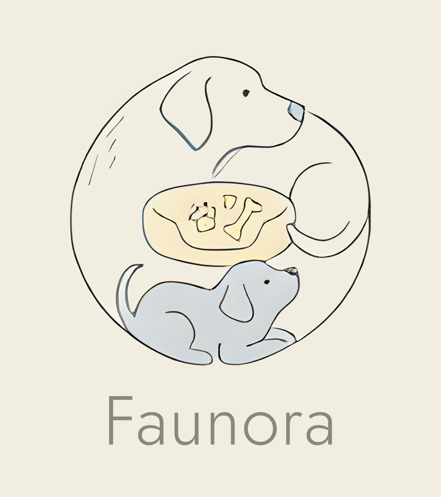

# Faunora

**Diet consultation with professional pet nutritionists, and homemade meals cooked in our own kitchen.**

A Venture Creation project at BINUS University, 2026.

- **Website:** https://kaynederon-maker.github.io/faunora/
- **Film (90 s):** [video/Faunora_Ad_90s.mp4](video/Faunora_Ad_90s.mp4)

## What's here

| Path | Contents |
|---|---|
| `index.html`, `style.css`, `script.js` | The Faunora website: plain HTML/CSS/JavaScript, responsive, no build step |
| `assets/` | Images, logo and the site's background score |
| `video/Faunora_Ad_90s.mp4` | The 90-second brand film "From the land to the bowl" (1080p) |
| [`docs/Robust Design Factors_Faunora.docx`](docs/Robust%20Design%20Factors_Faunora.docx) | GSLC: Robust Design Factor Identification (P-diagram, control and noise factors, L9 experiment, FMEA) |
| [`docs/Prototype Testing Report and Feedback Grid_Faunora.docx`](docs/Prototype%20Testing%20Report%20and%20Feedback%20Grid_Faunora.docx) | GSLC: Customer discovery prototype testing report and Feedback Grid |

To run the website locally, open `index.html` in a browser.

## The website

- Diet consultation with nutritionist profiles and a booking form (prototype, no backend)
- Catering: farm-to-bowl timeline that fills as you scroll
- In-house shop for meals, snacks, toys and pet fashion, with an animated add-to-bag
- Reviews, About, a "founded in five minutes" History, and the team
- Background music with a mute button in the top right

## Team

| Name | Student ID | Role |
|---|---|---|
| Siegfried Vesakha Setiawan | 2802405882 | CEO |
| Kayne Deron Kusnadi | 2802405150 | COO |
| Angelino Delvin | 2802526271 | CFO |
| Andi Siti Maryam Shaskirana | 2802462500 | CMO |

## Credits and disclosure

Photography, team illustrations, the film, its characters, the voiceover and the music were generated with AI tools (ComfyUI with SDXL, Google Flow, Google Gemini and Google AI Studio). The people and reviews shown are fictional, and booking and checkout are simulated, since this is a student prototype.
